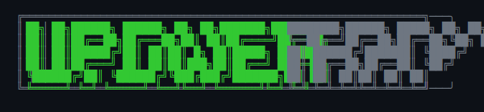
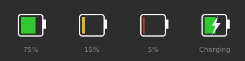

<p align="center">
  <picture>
    <source media="(prefers-color-scheme: dark)" srcset="docs/logo.svg">
    <source media="(prefers-color-scheme: light)" srcset="docs/logo.svg">
    
  </picture>
</p>

<p align="center">
  <a href="https://github.com/BenGWeeks/upowertray/actions/workflows/ci.yml">
    
  </a>
  <a href="https://github.com/BenGWeeks/upowertray/releases">
    
  </a>
  <a href="https://github.com/BenGWeeks/upowertray/blob/main/LICENSE">
    
  </a>
</p>

A simple, lightweight battery tray indicator for Linux using UPower. Works natively with KDE Plasma on Wayland.

## Why?

KDE Plasma's built-in battery indicator is tied to PowerDevil. If you disable PowerDevil (e.g., to let systemd-logind handle lid-close hibernate), the battery icon disappears.

Existing alternatives like `cbatticon` and `fdpowermon` use GTK and the legacy XEmbed protocol, which doesn't work on Wayland (KDE uses StatusNotifierItem).

**upowertray** solves this by:
- Using Qt6's `QSystemTrayIcon` which automatically uses StatusNotifierItem on KDE
- Reading battery data directly from UPower via DBus
- **Not** taking any inhibitor locks (won't interfere with systemd power management)

## Features

- Shows battery percentage with color-coded icon (green/yellow/red)
- Charging indicator (lightning bolt overlay)
- Tooltip with current percentage, state, and power profile
- Settings dialog showing system power settings (UPower + logind)
- Power profile control (Power Saver / Balanced / Performance)
- Multi-language support (English, Spanish)
- Updates every 30 seconds
- Left-click to open settings dialog

## Configuration

Left-click the tray icon to view power settings. The dialog shows:
- Current battery status
- Notification thresholds (from UPower)
- Battery critical action (from UPower)
- Lid close action (from systemd-logind)
- Power profile selector

Settings are read from system config files:
- `/etc/UPower/UPower.conf` - Battery thresholds and actions
- `/etc/systemd/logind.conf` - Lid close behavior

## Icon Preview



The icon changes color based on battery level:
- **Green**: Above 20%
- **Yellow**: 10-20%
- **Red**: Below 10%
- **Lightning bolt**: Charging

## Dependencies

- Qt6 (Core, Gui, Widgets, DBus, LinguistTools)
- UPower (usually pre-installed on Linux)
- CMake 3.16+
- C++17 compiler

### Ubuntu/Debian

```bash
sudo apt install qt6-base-dev qt6-tools-dev libgl1-mesa-dev cmake build-essential
```

### Fedora

```bash
sudo dnf install qt6-qtbase-devel qt6-linguist cmake gcc-c++
```

### Arch Linux

```bash
sudo pacman -S qt6-base qt6-tools cmake
```

## Install from PPA (Ubuntu)

```bash
sudo add-apt-repository ppa:bengweeks/upowertray
sudo apt update
sudo apt install upowertray
```

## Build from Source

```bash
git clone https://github.com/BenGWeeks/upowertray.git
cd upowertray
mkdir build && cd build
cmake ..
make
```

## Install

```bash
sudo make install
```

Or copy manually:

```bash
sudo cp upowertray /usr/local/bin/
sudo cp ../upowertray.desktop /usr/share/applications/
```

## Autostart

Copy the desktop file to your autostart directory:

```bash
cp upowertray.desktop ~/.config/autostart/
```

Or add `upowertray` to your desktop environment's startup applications.

## Sleep Modes Explained

| Mode | What happens | Battery drain | Resume time |
|------|--------------|---------------|-------------|
| **Suspend** | RAM stays powered | 5-10%/day | Instant |
| **Hibernate** | RAM → disk, power off | 0% | 10-30s |
| **HybridSleep** | RAM → disk, then suspend | ~2-3%/day | Instant* |

\* HybridSleep resumes instantly if battery is OK, or from disk if battery died.

### Recommended Configuration

| Trigger | Action | Why |
|---------|--------|-----|
| Lid close | Hibernate | 0% drain when laptop is put away |
| Battery critical | HybridSleep | Quick wake if plugged in, safe if battery dies |

See [docs/HIBERNATE.adoc](docs/HIBERNATE.adoc) for setup instructions.

## Verify No Inhibitors

To confirm upowertray doesn't interfere with systemd power management:

```bash
systemd-inhibit --list --mode=block
```

upowertray should NOT appear in this list.

## Development

### Code Style

This project uses clang-format for consistent code formatting and clang-tidy for static analysis.

#### Install Development Tools

```bash
# Ubuntu/Debian
sudo apt install clang-format clang-tidy cppcheck

# Fedora
sudo dnf install clang-tools-extra cppcheck

# Arch
sudo pacman -S clang cppcheck
```

#### Format Code

```bash
# Format all source files
find src -name '*.cpp' -o -name '*.h' | xargs clang-format -i

# Check formatting without modifying
find src -name '*.cpp' -o -name '*.h' | xargs clang-format --dry-run --Werror
```

#### Run Static Analysis

```bash
# Generate compile_commands.json
cmake -B build -DCMAKE_EXPORT_COMPILE_COMMANDS=ON

# Run clang-tidy
find src -name '*.cpp' | xargs clang-tidy -p build

# Run cppcheck
cppcheck --enable=warning,style,performance,portability src/
```

### Running Tests

```bash
cmake -B build -DBUILD_TESTING=ON
cmake --build build
cd build && ctest --output-on-failure
```

### Translations

Translation files are in `translations/`. To update translations:

```bash
# Update .ts files from source
lupdate src/*.cpp src/*.h -ts translations/upowertray_*.ts

# Compile .ts to .qm
lrelease translations/upowertray_*.ts
```

### CI/CD

GitHub Actions run on every push and pull request:
- **Build**: Compiles the project
- **Test**: Runs unit tests
- **Lint**: Checks code formatting and runs static analysis

## Documentation

- [Installation Guide](docs/INSTALLATION.adoc)
- [Hibernation Setup](docs/HIBERNATE.adoc)
- [Troubleshooting](docs/TROUBLESHOOTING.adoc)
- [Solution Architecture](docs/SOLUTION_ARCHITECTURE.adoc)
- [Packaging Guide](docs/PACKAGE.adoc)

## Contributing

1. Fork the repository
2. Create a feature branch (`git checkout -b feature/amazing-feature`)
3. Ensure code is formatted (`clang-format -i src/*.cpp src/*.h`)
4. Commit your changes (`git commit -m 'Add amazing feature'`)
5. Push to the branch (`git push origin feature/amazing-feature`)
6. Open a Pull Request

## License

MIT License - see [LICENSE](LICENSE)
